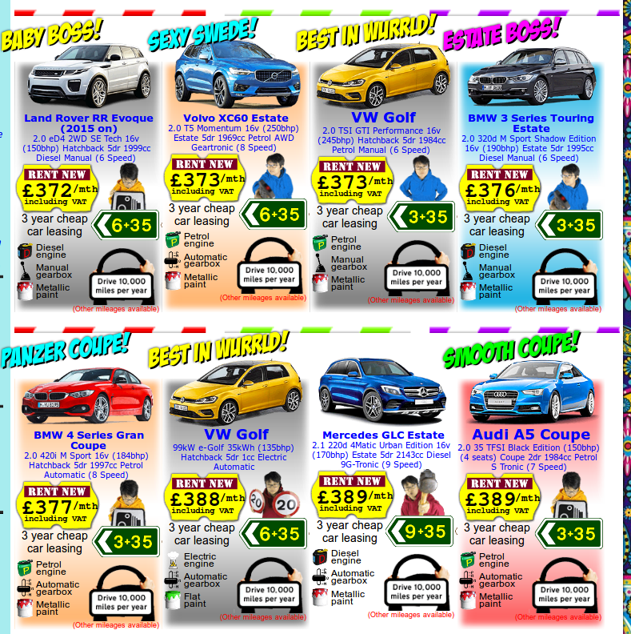
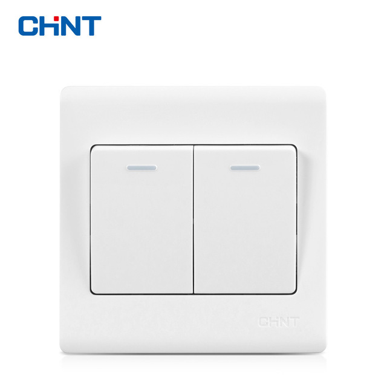

# Example of Appliances / Web Features with Bad UI
Assigment 0 in Human and Computer Interaction

by

Name : Ferdinand Jason G \
NRP  : 05111640000033 \
Class: IMK - A

## Outline
- [Example of Appliances / Web Features with Bad UI](#example-of-appliances--web-features-with-bad-ui)
    - [Outline](#outline)
    - [1. Zippyshare.com](#1-zippysharecom)
        - [1.2 Bad UI](#12-bad-ui)
        - [1.3 Suggestions](#13-suggestions)
        - [1.4 Demonstration](#14-demonstration)
    - [2. LINGsCARs.com](#2-lingscarscom)
        - [2.2 Bad UI](#22-bad-ui)
        - [2.3 Suggestions](#23-suggestions)
        - [2.4 Demonstration](#24-demonstration)
    - [3. Lamp Switch](#3-lamp-switch)
        - [3.2 Bad UI](#32-bad-ui)
        - [3.3 Suggestions](#33-suggestions)
        - [3.4 Demonstration](#34-demonstration)

## 1. Zippyshare.com
Zippyshare is a legitimate file hosting site which is designed to allow users share documents, software and other files. Despite how useful it looks, this website is not safe and might put your computer's security at risk. Below is the example of download page in Zippyshare.

### 1.2 Bad UI
- **To Simple UI** just too simple for well-known website.
- **No Register Option** for new user to register to zippyshare.
- **Server have high change to failed load the media** proved by screenshot above.
- **Too many Adversitement and Redirection to new tab** on click in *Download Image*, *Form Field Username and Password*, *Media*, *Click on change Languange* and other place.

### 1.3 Suggestions
- **Make new UI** make zippyshare more known by other because good UI
- **Make register option** new member for zippyshare.
- **Update the player** on media, and avoid server failed.
- **Reduce on Click Adversitement/Redirection** on some field that important by user to do.

### 1.4 Demonstration
Here's demonstration of **Too many Adversitement and Redirection to new tab** on *Download and Login Feature*.
[LINK]

## 2. LINGsCARs.com
LINGsCARSs.com is a website owned by Ling, with his favourite tag *UK's favourite car leasing website, I am LING you can trust me*.
Homepage of the site looks like screenshot below

My first impression was *WOW*, for me it's have a bad UI. LINGsCARSs.com is small website with full of contents.

### 2.2 Bad UI
- **Abusing Color**
this website using color combinations that hurt your eyes in background and pop up color / adversitement. GIF Image using hard color, sometimes hurt your eyes, overall this website too colorfull.

- **Confusing Icons** 
at my opinion, the icon of *Metallic Paint* or *Flat Paint*, doesn't clearly convey what they represent.

- **Image cover the text** there some images is cover other text, so is hard to recognize the text.

- **Not Responsive Website** some stuff like sub menu or image is out of the box or cover other element, 
- **Large Homepage** all list of leasing cars only in one page.
- **A lot of 'Adversitement'** make buyer/customer want to close the website.

### 2.3 Suggestions
- **Use soft color in background** because website content is to much. Using soft color buyer/customer can stay a little more time in your website.
- **Use multiple page** to list leasing cars, by using multiple page, your homepage faster to load.
- **Make Responsive Feature** and read-able element,by make your website responsive, buyer/customer can relate and can stay more time in your website to choosing leasing cars.
  
### 2.4 Demonstration
Here's demonstration of **Not Responsive Website** on *this Feature*
[LINK]

## 3. Lamp Switch
Lamp Switch is an objects that we often to use in our daily lives. In general, lamp switch have shape like image below.

### 3.2 Bad UI
- **Doesn't have mark for on/off**. We have to figured out by our self what condition so switch is for on or off state, it seems easy on normal case, but how about power outage?. We need to wait until power normal again.

### 3.3 Suggestions
- **Give a mark for on state** or **Give 1 for on state and 0 otherwise**

### 3.4 Demonstration
Here's demonstration of **Lamp Switch** on [LINK]